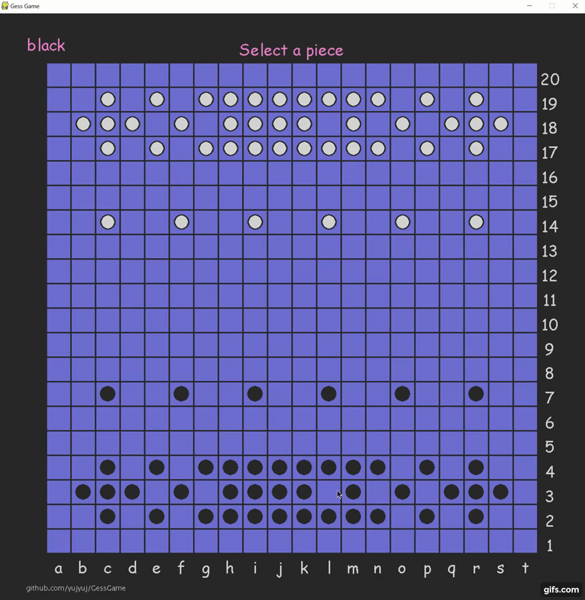

<!-- Heading -->
# Gess Game

<!-- Links -->


<!-- Inline code block  -->
An abstract board game called Gess. The initial version is text-based where player needs to manually initialize a game object, type every move and check game status. This project adds GUI to it by creating a new class that inherits the initial GessGame class and adds extra features provided by Pygame. 

### Rules
Played on an 18x18 board by two players, black and white. 3x3 group of stones moves as a unit called a piece.
<!-- Unordered list -->
* Select a piece by clicking the center stone.
* Select destination by clicking the center square of where you want the piece to move to.
* Legal moving direction: if there is a stone in the corresponding spot on the perimeter of the piece, it can move in that direction.
* Legal moving distance: if there is stone in the center, the piece can move any unobstructed distance. Otherwise, up to 3 squares.
* Captured stones and off boundary stones are removed.
* A player loses when they have no remaining rings (8 stones around an empty center).

There's an online implementation [here](https://gess.h3mm3.com/) to play, but it's not 100% consistent with the rules of this project.


### Instruction
Option 1: Use python interpreter

Place the following 4 Pyhon files in a folder, then run the ```main.py```.
``` 
main.py
GessGame_Pygame.py
GessGame.py
constants.py
```

Option 2 Use ```pyinstaller``` to make an executable that can be downloaded and run on any Windows machines without any dependencies/packages/python interpreter.
* step 1, intall ```pyinstaller``` with ```pip install pyinstaller```
* Step 2, Place the following 4 Pyhon files in a folder
``` 
main.py
GessGame_Pygame.py
GessGame.py
constants.py
```
* step 3, Open command line and run  ```pyinstaller main.py --onefile --noconsole```
* step 4, Two folders ```build``` and ```dist``` should be generated. Open the ```dist``` folder and there exists the executable.

<!--  Images -->



